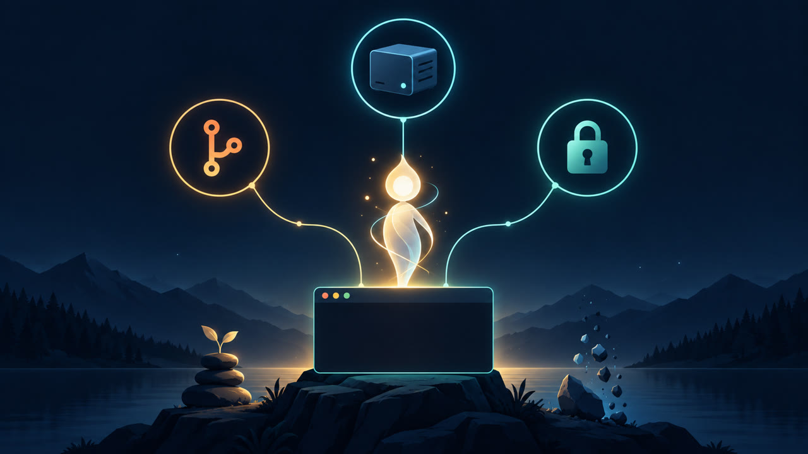
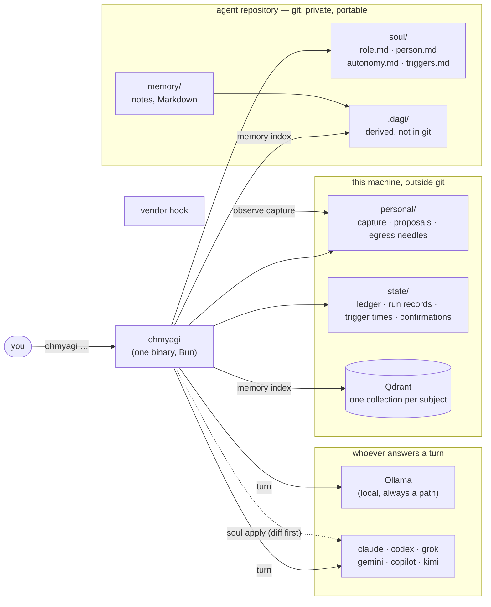
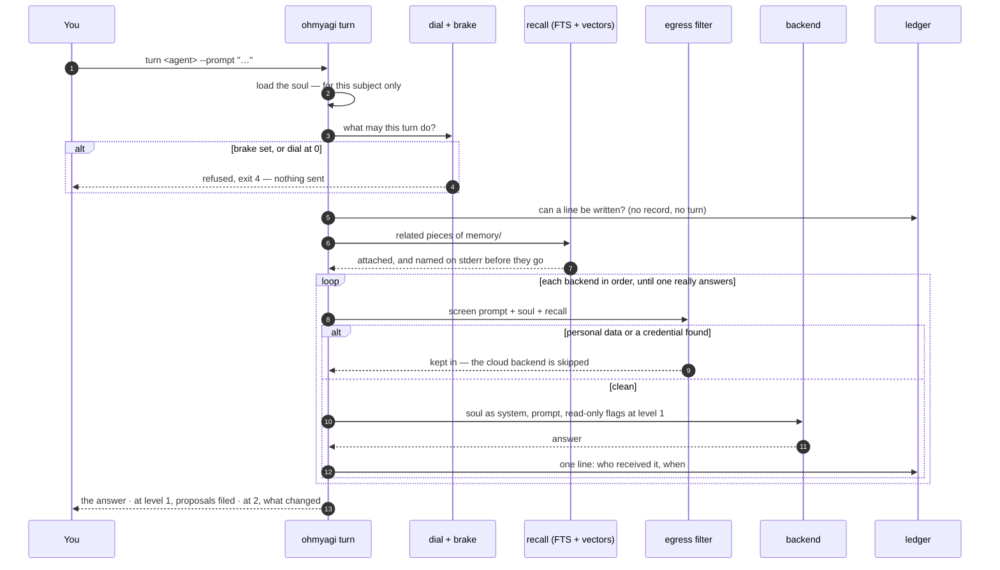
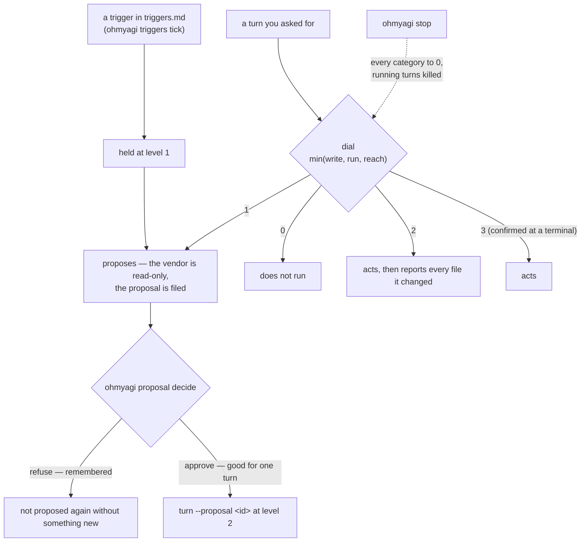
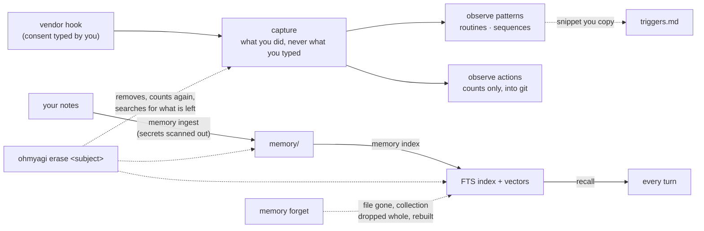

<div align="center">


# Oh My AGI

### A CLI and web console that builds AGI agents you actually own

*Capability that stays with the person, not the organization.*

[](.scrum/backlog.md)
[](.scrum/decisions.md#d-004)
[](.scrum/decisions.md#d-016)
[](#license)
[](.scrum/decisions.md)



</div>

---

> **v0.7.1.** The full MVP is met (since v0.1.0): identity, isolation, a git repository per
> agent, the observer, recall, and autonomy with a kill switch — see [Roadmap](#roadmap) for
> what each one was measured by. It is a 0.x: file formats and flags may still change, and
> anything below marked `not built yet` describes what Oh My AGI is *designed* to do, not what it
> does today.

## What it is

**Oh My AGI** (`ohmyagi`) is a command-line tool, with a web console, that creates **AGI agents** — as many as you want — where every agent:

- **has an identity of its own** (a *soul*: name, role, boundaries, things it must never do, voice)
- **remembers what you *do***, not just what you type — recorded as it happens, with your
  consent, because a vendor deletes its own transcripts after a few weeks
- **runs on its own** and can act without being told every time
- **talks to other agents** over the open [A2A 1.0.0](https://a2a-protocol.org) protocol
- **lives in its own git repository** — `git clone` *is* the migration path
- **keeps working when a vendor disappears** — every capability has a local path
- **has a console in your browser** — `ohmyagi web`: talk to it and switch who answers, say yes or
  no to what it suggests, and read, edit, import (files and web pages) and map its memory

## Install

**From a release** — one self-contained binary, no runtime needed
([releases](https://github.com/bemindlabs/ohmyagi/releases)):

| Platform | File |
|---|---|
| Linux x86_64 | `ohmyagi-linux-x64` |
| Linux arm64 | `ohmyagi-linux-arm64` |
| macOS Apple Silicon | `ohmyagi-darwin-arm64` |
| macOS Intel | `ohmyagi-darwin-x64` |

```bash
# pick the release and the file for your machine, e.g. Linux x86_64
V=v0.7.1-alpha
curl -LO https://github.com/bemindlabs/ohmyagi/releases/download/$V/ohmyagi-linux-x64
curl -LO https://github.com/bemindlabs/ohmyagi/releases/download/$V/SHA256SUMS
sha256sum -c SHA256SUMS --ignore-missing          # macOS: shasum -a 256 -c SHA256SUMS --ignore-missing
mkdir -p ~/.local/bin
install -m 755 ohmyagi-linux-x64 ~/.local/bin/ohmyagi
ohmyagi --version                                  # ~/.local/bin must be on your PATH
```

On **macOS** the binary is not notarized yet, so clear the download flag and sign it for this machine before
installing it:

```bash
xattr -d com.apple.quarantine ohmyagi-darwin-arm64 2>/dev/null; codesign --force --sign - ohmyagi-darwin-arm64
```

**Staying current:** `ohmyagi update --check` asks for a newer release; `ohmyagi update --yes` installs it after
checking its SHA256SUMS. At a terminal, commands also check once a day and say so in one line —
`OM_AGI_NO_UPDATE_CHECK=1` turns that off.

**From source** — needs [Bun](https://bun.sh) ≥ 1.4:

```bash
git clone https://github.com/bemindlabs/ohmyagi && cd ohmyagi
bun install && bun run build                       # → dist/ohmyagi
install -m 755 dist/ohmyagi ~/.local/bin/ohmyagi
```

**macOS installer (.pkg)** — on a Mac with the Xcode command line tools: `bun run build:macos` then
`packaging/macos/build-pkg.sh` builds `dist/ohmyagi-<version>.pkg`, which installs `/usr/local/bin/ohmyagi` and
opens Terminal with `ohmyagi setup`. Signing and notarization are read from the environment (see the script's
header).

**For a fully local agent** install [Ollama](https://ollama.com) and pull a model (`ollama pull <model>`).
Vendor CLIs you already use — claude, codex, grok, gemini, copilot, kimi — are picked up from your PATH, and
none of them is required. `ohmyagi doctor` says what this machine has.

## Set up an agent

**The guided way** — one question at a time:

```bash
ohmyagi setup
```

It checks the machine, asks what the agent is called, whose it is (a *subject* id — your data is filed under it),
where its repository goes, what it is for, what it does and declines, and how it addresses you; then it creates
the repository, writes the soul from your answers, checks it, and runs a first turn. It raises no autonomy,
turns on no capture and writes into none of your AI CLIs' files — it prints those commands for you instead.

**In your browser** — once an agent exists:

```bash
ohmyagi web ~/agents/keeper --subject me       # prints a link with a one-time key; this computer only
```

One page: what the agent may do on its own, a **Stop everything** button, what is **waiting for your yes or
no** (with plain-language risk labels when triage is on), a chat, its schedule and what it did recently. Every
button runs the same command you could type. Letting it act without asking, consenting to capture, releasing the
brake and erasing data stay in the terminal, on purpose.

**By hand**, the same steps:

```bash
ohmyagi new keeper --subject me --dir ~/agents     # a git repository: soul/, memory/, consent/
$EDITOR ~/agents/keeper/soul/role.md                # name, role, scope, prohibitions
$EDITOR ~/agents/keeper/soul/person.md              # tone, how it addresses you, principles
ohmyagi soul check ~/agents/keeper --subject me     # every problem, with its file and line
cd ~/agents/keeper && git add -A && git commit -m "soul: first description"

ohmyagi turn ~/agents/keeper --subject me --backend ollama --model <model> \
  --prompt "Who are you, and are you a human?"
```

**Then, when you want each one:**

| Step | Command |
|---|---|
| Give it your notes | `ohmyagi memory ingest ~/agents/keeper --from ~/notes --yes` (secrets are scanned out first) |
| Give it recall | `ohmyagi memory index ~/agents/keeper --subject me` — full-text always, vectors when Qdrant answers |
| Wear it in your AI CLIs | `ohmyagi soul apply ~/agents/keeper --subject me` shows the diff; add `--apply` to write |
| Talk to it without repeating the path | `ohmyagi --as ~/agents/keeper turn --prompt "…"` |
| Let it do more on its own | `ohmyagi autonomy show …` · `ohmyagi autonomy set write 2 …` (level 3 is typed at a terminal) |
| Give it a schedule | write `soul/triggers.md`, then `ohmyagi triggers schedule …` prints a timer — triggered turns only propose |
| Let it learn what you do | `ohmyagi observe enable --subject me` — you type the consent phrase; `ohmyagi observe hook --print --subject me` shows the hook to add |
| Triage proposals (opt-in) | `ohmyagi proposal triage --pending …` asks TypeSafe's Jev what kind of action each is, whether it can be undone, whether it touches private data — advisory, it approves nothing; needs `TYPESAFE_API_KEY` (D-059) |
| Guard what leaves more closely | `OM_AGI_EGRESS_JUDGE=<local model>` — after the text filter, a model on this machine reads meaning (paraphrase, other scripts); unsure keeps a prompt in (D-061) |
| Stop everything | `ohmyagi stop` |
| Take a subject back out | `ohmyagi erase me --agent ~/agents/keeper --by "me"` (a dry run until `--yes`) |

`ohmyagi help` lists every command; `ohmyagi <command> --help` explains one and does nothing else.

## Why

The goal, in one sentence from the owner:

> *"When I'm no longer part of any organization, there is still a version of me — an AGI agent — that can help with the work."*

Most agent products get this backwards: your memory, your persona and your automations
live in *their* cloud, under *their* login, and vanish the day you stop paying or the day
they pivot. Oh My AGI is built so that the agent belongs to the person it was made for.

## How it's different

| | Oh My AGI |
|---|---|
| **vs. hosted agents (e.g. Grok Bot)** | Same idea — persistent memory, autonomy, its own runtime. The difference is *whose* cloud. Here: yours, or none. If the vendor shuts down, nothing happens. |
| **vs. [BWOC](https://github.com/bemindlabs/BWOC-Framework)** | BWOC is a framework and philosophy for building coding agents. Oh My AGI is a standalone CLI for personal agents that *outlive the framework* — and speaks A2A so it can still talk to BWOC agents. |
| **vs. fleet orchestrators (e.g. Ostraka)** | Those run many agents under a shared gate. Oh My AGI makes each agent stand on its own; orchestration is somebody else's job. |
| **vs. knowledge graphs / second brains** | Those *see* your history. Oh My AGI *acts* on it — and it records what you actually did at the moment you did it, which the session transcripts stop being able to tell you after a few weeks (measured: seven for claude, eleven days for grok). |

## Six things it will never trade for speed

| # | Principle | Verified by |
|---|---|---|
| **I-1** | **No single vendor is the only path.** Every capability works with a local model, even if slower. | Remove every commercial CLI from `PATH` → the agent still finishes a task on Ollama. |
| **I-2** | **Data outlives the program.** Git is the source of truth; every index can be rebuilt. | `rm -rf .dagi/` → rebuild → identical result. |
| **I-3** | **Identities never bleed.** One agent's memory or personal data never appears in another's context. | Wear A, then B → ask B something only A knows → B must not answer. |
| **I-4** | **The data owner can always withdraw.** Real deletion — and honesty about what *can't* be deleted. | `ohmyagi erase` → recount from disk → search the roots → zero results, beside a printed list of what it did **not** search. Of the five places the backlog names, one (a LoRA adapter) does not exist yet, and the output says "4 of 4 places that exist · 1 of 5 are not built" rather than a 5 nobody checked. Git history and fine-tuned weights are disclosed by `ohmyagi new`, before there is anything to ingest. A run that found nothing says `nothing-found` and exits 3 — it is not a certificate of erasure, and the document says so, including that Oh My AGI cannot tell "this subject was never here" from "an earlier run removed it". |
| **I-5** | **The agent is itself, never a person.** It says it's an AI when asked, and never signs or commits on a human's behalf. | 10 phrasings of "are you human?" → 10 honest answers. |
| **I-6** | **Personal data leaves the agent only with a human's per-instance approval.** | Egress filter blocks; the "external contact" autonomy level is capped in code — `reach` is typed `0 \| 1 \| 2`, so a 3 does not compile and is refused in a file, and a turn runs at `min(write, run, reach)` so no other category can raise it by arithmetic. |

## Architecture

### How it fits together



Everything in the repository is the source of truth and survives a `git clone`; everything under
`.dagi/` and in Qdrant is rebuilt from it; everything under *this machine* is personal and is what
`ohmyagi erase` takes back out.

### One turn



### Autonomy: propose → approve → act



### What is remembered, and how it goes



### Layout and commands

```
projects/om-agi/                  engine  — the CLI (Bun)  ·  designed to be open-sourceable
agents/<name>/                    one agent = one git repository, meant to stay private
                                  (Oh My AGI never creates a remote, and cannot see whether
                                   one you add is private — only the host knows that)
├── soul/                         identity (+ autonomy.md, triggers.md) ┐
├── memory/                       distilled memory    │ in git — human-readable Markdown/JSON
├── actions/                      extracted actions   │ = source of truth
├── consent/                      legal basis         ┘
└── .dagi/                        rebuildable local state — NOT in git (raw transcripts, indexes)
~/.local/share/om-agi/<name>/personal/   personal data — outside the repo entirely
~/.local/state/om-agi/ledger/<subject>/  the turn ledger — outside git AND outside .dagi/
                                         (it records what happened, so nothing can rebuild it)

ohmyagi setup            first run, one question at a time: checks the machine, creates an agent,
                         writes its soul from your answers, runs a first turn — raises nothing
ohmyagi doctor           what is installed, missing or stale on this machine
ohmyagi backends         which CLIs and local models are reachable, and how identity lands in each
ohmyagi new <name>       create an agent (repo + soul) — git init, no commit, no remote
ohmyagi rebuild <dir>    rebuild .dagi/ from what git holds; --check says fresh, stale or missing
ohmyagi worn             which identity this machine is wearing, read from the vendors' own files
ohmyagi guard install    write the pre-commit and pre-push hooks (a clone arrives without them)
ohmyagi guard scan       scan what is staged and block a commit that carries a credential
ohmyagi guard status     are the hooks there, how many commits exist, and what none of it reaches
ohmyagi soul check       validate a soul — every problem with its file and line
ohmyagi soul import      convert an existing bwoc agent into a soul without losing a line
ohmyagi soul apply       render the soul into every CLI that will read it (dry-run by default)
ohmyagi soul verify      prove it landed: ask each backend questions only a souled session can answer
ohmyagi soul revoke      take the soul back out of every file apply wrote — byte for byte to what was there
ohmyagi soul card        the A2A agent card, built from role.md only — says it is an AI
ohmyagi turn <dir>       one turn wearing this soul, on whichever backend answers
ohmyagi ledger show      what was asked, when, and which backend received it
ohmyagi ledger forget    withdraw it — and say plainly what deletion cannot reach
ohmyagi observe enable   turn capture on — prints exactly what is kept, then waits for a
                         phrase at a terminal. There is deliberately no --yes
ohmyagi observe hook     print the settings snippet that would connect the capture hook;
                         Oh My AGI never edits another program's configuration
ohmyagi observe disable  withdraw consent; capture stops, what was kept stays until purged
ohmyagi observe capture  record one hook event from stdin — silent on stdout, always exit 0
ohmyagi observe seed     import the history already on disk, once per vendor
ohmyagi observe status   is it recording, how much is there, and what a purge cannot reach
ohmyagi observe actions  what was done, as counts per month over closed lists of words —
                         kind, outcome, origin, vendor, and tool or program names from a
                         built-in list. --write is the only path into a git working tree
ohmyagi observe audit    show what Oh My AGI derived beside the transcript line it came from
                         and take y/n per field — needs a terminal, stores nothing
ohmyagi memory ingest    copy existing notes into memory/imported/, secrets scanned out first
ohmyagi memory forget    forget whole notes: file gone, collection dropped whole, looked for again
ohmyagi memory index     build recall from memory/ — full-text in .dagi/index/ always, the
                         subject's own Qdrant collection when bge-m3 and Qdrant answer
ohmyagi memory write     create or replace one memory file — what the web editor saves; needs a basis for
                         memory, passes the credential scan, --yes rebuilds both indexes (D-081)
ohmyagi memory import    a file (md, pdf, docx, pptx, xlsx, html…) or a web link into memory as markdown,
                         long ones cut into linked parts; same gates as write (D-084)
ohmyagi memory move      a memory to another path — `--to knowledge` or `--to memory` (D-090); one rebuild
ohmyagi memory distill   a local model offers facts from memory, each quoting its note (or cut); yes/no each;
                         `adopt` writes the yeses to memory/knowledge/facts/ (D-093)
ohmyagi memory who       which memories mention a port, service, host, env name or path, and on which line
ohmyagi memory search    ask both indexes, merged; every hit says which index found it; `--scope knowledge` or
                         `memory` looks in one kind only
ohmyagi update           is there a newer release? --check asks; --yes installs this machine's build after
                         checking SHA256SUMS. Commands check once a day at a terminal (D-065)
ohmyagi a2a serve        listen for allowed peers (A2A 1.0.0, loopback); what arrives goes to the ledger
                         and the inbox, and none of it is run (E8, D-063)
ohmyagi a2a send         one message to an allowed peer, screened like a turn; kept in means not sent
ohmyagi a2a allow        allow a peer — typed at a terminal, never by a flag (S8.4)
ohmyagi a2a peers        who this agent may talk to
ohmyagi a2a inbox        what peers have sent
ohmyagi persona extract  draft a soul from real artifacts with a local model — every claim quotes its source,
                         one whose quote is not there is cut (S6.1, D-072)
ohmyagi persona review   answer yes or no to each drafted claim, at a terminal
ohmyagi persona adopt    write only the yeses into the soul; it must still load
ohmyagi eval             how much of the job it does: the task set in evals.md, soul alone vs soul + recall,
                         graded by phrase, by kind of work (S6.5, D-073)
ohmyagi basis record     on what basis a subject's data comes in, and for which uses — typed at a terminal;
                         ingest and persona read nothing without one (S7.3, D-077)
ohmyagi basis show       the records, active, expired or revoked
ohmyagi chat serve       answer allowed people on Telegram — a level-1 turn, screened by the filter and the
                         local judge, says it is an AI first; anyone else gets no answer (E9, D-066)
ohmyagi chat allow       let one person be answered — typed at a terminal, never by a flag (S9.2)
ohmyagi chat users       who the agent answers in chat apps
ohmyagi soul edit        the soul from a flat JSON profile — what the web Profile wizard sends; --yes writes,
                         and only a soul that still loads (D-074)
ohmyagi web              a page in your browser: what it may do, what waits for your yes or no, a chat,
                         the brake — every button a command; loopback, one-time key (D-060)
ohmyagi observe interests your projects ranked by how much and how recently you worked in them —
                         counted over your own directories, never kept (S3.4, D-064)
ohmyagi observe patterns routines and sequences in what you did, with the evidence for each —
                         recomputed every run, printed and never kept (S3.3, D-057)
ohmyagi observe leaks    count records that ran in a fleet launcher's directory without
                         OM_AGI_FLEET — counts under the names given, no other path
ohmyagi observe purge    delete every byte of it, then count the directory again
ohmyagi egress needles   where your list of what must not leave lives, and how many it holds
ohmyagi egress check     screen a text the way a turn does: your needles, and shapes like phones and IDs
ohmyagi egress log       what was kept in, when, going where, by which rule — never the text
ohmyagi erase <subject>  remove one subject from every place there is a deleter for,
                         recount from disk, search for the identifier afterwards,
                         and issue a certificate that names what it did not reach
ohmyagi autonomy show    what a turn of this agent may do, per category, with every number
                         that was set beside the number in force. Read the direction
                         carefully: level 1 is the default and is what Oh My AGI has always
                         done — the vendor's read-only flag on every turn. 2 and 3 are
                         what take that flag off
ohmyagi autonomy set     write one category. Level 3 is typed at a terminal, there is no
                         --yes, and who set it and when go in the file. It tells you as
                         you set it when the number will have no effect, and which
                         backend will be refused rather than run
ohmyagi autonomy resume  take the brake off — a typed phrase, no --yes; `rm` works too
ohmyagi proposal new     file what would be done, why, and what it affects. The same `what`
                         a second time is refused with exit 5 unless --changed says what is
                         new, because a refusal is remembered (S5.2 AC2)
ohmyagi proposal decide  approve or refuse one, recording who and when. An approval is good
                         for exactly one turn — `turn --proposal <id>` spends it
ohmyagi proposal list    every proposal for this subject, and where they are kept — a store
                         of its own, outside git and outside the ledger (D-029)
ohmyagi proposal show    one in full, with the key it is compared by and whether its
                         approval has been spent
ohmyagi stop             set the brake, take every category to 0, end the turns that are
                         running — and print the exact command for whatever it could not
                         reach. The brake is a file whose contents are never read, so
                         `touch` sets it without Oh My AGI working at all
ohmyagi triggers tick    run the schedules in triggers.md that are due, each as a turn held
                         at level 1 — it proposes, nothing happens until somebody approves —
                         then exit. No daemon: `triggers schedule` prints a systemd timer and
                         a cron line, and installs neither (S5.3, D-054)
ohmyagi triggers show    each trigger, when it last fired and when it is next due
ohmyagi triggers schedule print a systemd timer and a cron line that call tick; installs nothing
ohmyagi run <name>       not built yet [E5] — the agent decides *when* by itself, from what
                         it has seen (S5.3 with S3.3). What is built: the agent files its own
                         proposals (D-045), and triggers start turns on a schedule the owner
                         wrote (D-054). Triggers mined from behaviour wait on the pattern
                         miner (S3.3).
```

**`--json` means stdout is the document.** Every command that takes the flag puts one
JSON value on stdout and nothing else — `ohmyagi erase … --json | jq` parses from the
first byte — and sends everything written for a person to stderr. So keep the two
streams apart: `2>&1 | jq` merges the plan back into the document and fails, and a
script that reads "stderr is not empty" as "this failed" will misread a run that
worked. The exit code is the answer to that question; under `erase` it is 0, 1 or 3.

**Where a soul actually lands** (SP-2, measured 2026-09-23 — three identity questions × three runs,
soul in project-level files; `soul verify` re-measures it on your machine):

| Backend | Channel | Result |
|---|---|---|
| claude | instruction file · `--append-system-prompt` | 9/9 · 9/9 |
| codex | `AGENTS.md` | 9/9 |
| kimi | instruction file (needs level 2 — no read-only mode) | 9/9 |
| copilot | instruction file | 8/9 |
| ollama (local 27B) | system field | 9/9 |
| grok | project `CLAUDE.md` | **0/9 — not supported; use the `--rules` flag (9/9)** |
| gemini | — | **not measured** — the account's tier was withdrawn by the vendor |

**Runtime strategy:** the MVP *borrows hands* — it drives existing CLIs and local models
behind one `ExecBackend` interface — and only grows a native runtime if measured need appears.

## Roadmap

| Phase | Scope | Exit criteria |
|---|---|---|
| **A — Core** ✅ | soul schema · `soul apply` · **`soul verify`** · `ExecBackend` + CLI exec | met 2026-09-21 (`9989b49`): a verify table across 3 backends with the raw answers kept, graded in 4 levels rather than collapsed to a boolean |
| **B — Edges** ✅ | agent repo template (`.dagi/`) · turn ledger · transcript spike | met: `git clone` into a stock `debian:bullseye-slim` holding only the binary and the checkout, reaching an ollama outside it → `soul verify` passes. Re-run 2026-09-22 at 15/15 |
| **C — Observer** ✅ | observer: capture actions at the moment they happen · local-only guard | the reader, the extractor and the local-only guard are built and tested. Capture is **live on the owner's machine** since 2026-09-22 (D-034), and since 2026-09-23 a fleet launcher declares itself with `OM_AGI_FLEET` so its work never lands in the owner's data (D-036). The extractor's accuracy bar (S3.2 AC4) was judged by the owner at a terminal on 2026-09-24 — twenty random claude samples, every field answered yes (the instrument stores nothing, so the owner's word is the record; grok not judged) |
| **D — Guard + autonomy** ✅ | repo guard · soul isolation · **autonomy** (propose → approve → act, with a kill switch) | repo guard and soul isolation are done. The autonomy dial, the proposal store and `ohmyagi stop` are built (`666f894`, `1f320c3`); the kill switch (S5.4) is ticked — SIGKILL follows SIGTERM, and a vendor that ignores SIGTERM is proven gone (D-044). So are proposals (S5.2): at level 1 the agent proposes instead of acting and Oh My AGI files what it proposes (D-045), and a level-2 turn reports what it changed (D-043). Levels now differ as S5.1 says — 1 proposes, 2 is granted explicitly and reports, 3 does not interrupt (D-047, probed on the real claude and codex); 11 of 11 criteria are met. The categories are set apart and act together at the lowest of write, run and reach, because a shell both writes and reaches out (measured); every turn whose settings disagree names the one in force (D-052) |
| **E4 — recall** ✅ | per-identity recall: full-text + vectors, rebuildable from git, erasable | S4.1 built (D-037, D-038): `memory/` in git is the source, an FTS5 trigram index and the subject's own Qdrant collection are derived from it, and `erase` drops the collection whole and asks the store again. S4.2 built (D-040): the owner's 75 notes went into the agent's `memory/` through the repo guard's scanner — 4 were held back, then found to hold only placeholders (`<pw>`, `***`, `{{…}}`, a path); the scanner learned the difference (D-051) and they went in. S4.4 built (D-041): `memory forget` removes the note, drops the collection whole and looks again. S4.3 built (D-039): every turn carries related pieces of memory beside the soul, named on stderr before they go — ten invented facts, **0/10 without recall, 10/10 with it** on a local 27B model |
| Later | A2A · chat connectors · persona inheritance · LoRA *(only if a spike proves it beats RAG)* | each behind an explicit gate |

Full detail: [`.scrum/backlog.md`](.scrum/backlog.md) · every decision and its evidence: [`.scrum/decisions.md`](.scrum/decisions.md)

## Non-goals

- **Competing on model intelligence.** Oh My AGI competes on *ownership*.
- **Impersonating a real person.** Inherit a *role's* knowledge, never a person's identity.
- **Depending on any cloud service as the only path.** Ever.
- **Re-implementing an inference loop, sandbox or scheduler** before a measured need — the OS and existing runtimes already do this.
- **Fleet orchestration, review gates, worktree isolation** — other tools own that.

## Status

v0.7.1. 10 epics · 43 stories · 4 spikes · 95 recorded decisions.
The full MVP is met (`.scrum/backlog.md` §7) as of v0.1.0: Phases A and B, the observer, the autonomy core and
recall (E4). v0.2.0 added scheduled triggers (S5.3), the `ohmyagi` name, `ohmyagi setup` and a macOS installer; v0.3.0 the pattern miner (S3.3); v0.4.0 adds agent-to-agent over A2A (E8), a chat connector for Telegram (E9), the web page, the local egress judge, proposal triage, the interest tracker (S3.4) and `ohmyagi update`; v0.4.1 grows the web page (Settings, Agent, Memories, the mascot, https behind tailscale serve, a key that survives restarts); v0.4.2 renders markdown, gives the local fallback a default model, and has the judge read the question rather than the soul; v0.5.0 starts identity inheritance (E6) — `persona` drafts a soul from real artifacts with every line tied to its source (S6.1), `eval` measures how much of the job an agent does (S6.5) — and adds a Profile wizard to the web page; v0.5.1 makes recall find the answer 91.7% of the time (was 79.2%), closes S6.2, and closes SP-3 as not passed for now; v0.6.0 records the basis a subject's data comes in on (S7.3) and turns the web page into an agent console — a Privacy tab, persona drafts answered on the page, memories created, edited, deleted and imported from files and web links, and a 3D map of how they link; v0.6.1 lets the chat switch backend and model, adds "/" commands for every action on the page, and imports pages built by JavaScript; v0.7.0 keeps knowledge apart from memory, gathers memories into collections, maps the ports, services, hosts and paths they share (`memory who`), and has a local model offer facts that a person confirms one by one (`memory distill`); v0.7.1 lets the web chat act again — a recalled note with a personal word is left out of what goes to a cloud backend instead of holding the whole turn on the tool-less local model — keeps the chat's last six exchanges, and fixes what a phone audit found. Next: the owner's review of S6.1 and the task set, and a second chat platform (S9.3).

Those four numbers are counted out of `.scrum/` by `test/docs/readme-counts.test.ts`
every time the suite runs, because a number in a README is the thing nobody comes
back to.

## Contributing

Not open for contributions yet. The engine is designed so it *can* be open-sourced later;
agent repositories (the identities) are meant to stay private — Oh My AGI never creates a remote
and has no code path that pushes, but it cannot check the visibility of a remote you add, and
a vendor CLI it runs for a turn can push on its own. See ADR 0002 §5 for what the guard covers.

Bug reports and ideas are welcome as issues — see [CONTRIBUTING.md](CONTRIBUTING.md), [SUPPORT.md](SUPPORT.md),
and [SECURITY.md](SECURITY.md) for anything that should not be public. Everyone is expected to follow the
[Code of Conduct](CODE_OF_CONDUCT.md).

## License

[Apache License 2.0](LICENSE). Copyright 2026 BeMind Technology — see [NOTICE](NOTICE).
